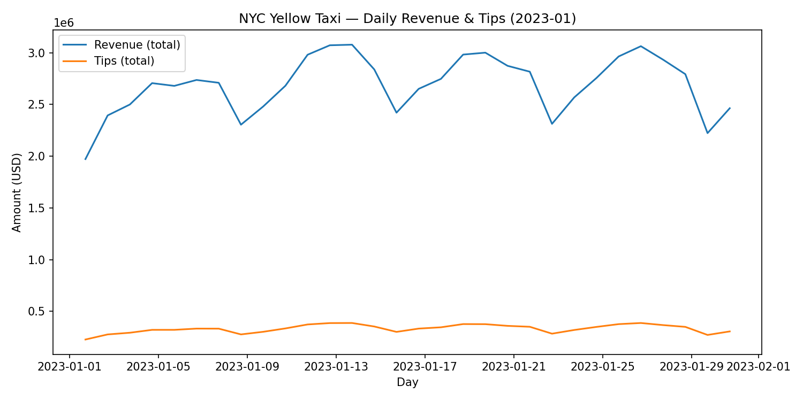

NYC Taxi — Spark-based Big Data Pipeline
End-to-end ETL workflow built with PySpark to process and analyze New York City Yellow Taxi trip data.
The pipeline reads public Parquet data, performs cleaning and feature extraction, joins external lookup tables (pickup/drop-off zones), computes daily revenue and tip aggregations, runs basic data-quality checks, and produces a visualization of daily earnings.

Stack: PySpark · Pandas · Matplotlib · Parquet
Features:
• Modular ETL scripts for ingestion, transformation, and enrichment
• Partitioned Parquet outputs for efficient querying
• Automated workflow via Makefile (ETL → Aggregation → Zone Join → DQ → Plot)
• Lightweight data-quality validator (dq_checks.py)
• Reproducible run: make all

Outcome: a clean, reproducible Spark pipeline demonstrating practical big-data handling, data-quality validation, and simple analytics suitable for cloud-scale extension (e.g., Delta Lake or multi-month batches).

# Spark ETL Project

## Data Quality & Validation
We include a small Spark-based checker to validate outputs:

```bash
python scripts/dq_checks.py

It reports:

Row counts per dataset (cleaned yellow, enriched yellow_zones, and aggregates/daily)

Null counts for critical columns (timestamps, locations, distance, amounts)

Date range and year–month coverage for pickup_ts

A preview of rows and day-level aggregate coverage


## Daily Revenue & Tips (Jan 2023)


## Quickstart
Clone the repo and run the full Spark ETL pipeline in one minute:

```bash
git clone https://github.com/krotov79/01_Spark_ETL.git
cd 01_Spark_ETL
make all

Outputs appear under data_parquet/, and the visualization is saved in
assets/daily_revenue_tips.png.
